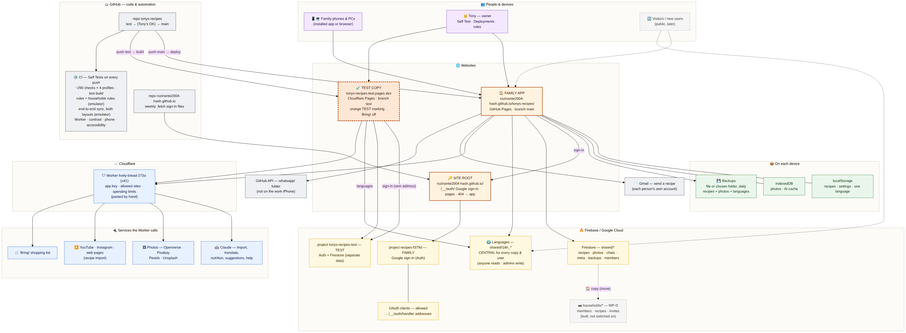

# Tony's Recipes — deployments and how the pieces connect

What runs where, who puts it there, and what depends on what. Written for Tony
and for whoever works on the app next. It holds **no secrets**: settings are
named, never given. Updated for **v36.88** (27 Sep 2026).

For *why* things are the way they are, see [`CLAUDE.md`](CLAUDE.md). For a
full specification from which the app could be rebuilt, see
[`RECONSTRUCTION_PROMPT.md`](RECONSTRUCTION_PROMPT.md).

---

## 1. The picture

*People at the top; the three websites (the family app, the site root that
serves Google sign-in, and the orange test copy); the Worker and the services
it calls on the left; what each device keeps on the right; both Firebase
projects along the bottom — with the central languages every copy reads, and
the households (WP-D) that the move copies into, dashed because they are
built but not switched on. The code and CI are top left.*

Zoomable version: [`docs/architecture.svg`](docs/architecture.svg). Source:
[`docs/architecture.mmd`](docs/architecture.mmd) (Mermaid) — **update it with
this document**, then redraw both images (render the `.mmd` with Mermaid in a
browser, as `docs/README` below says).

---

## 2. Every component

| Component | Where it lives | Address | Source | How it gets there | Who |
|---|---|---|---|---|---|
| **Family app** (the live copy) | GitHub Pages | https://rozinante2004-hash.github.io/tonys-recipes/ | repo `tonys-recipes`, branch **`main`** | `.github/workflows/deploy.yml` on every push to `main`. The page served is `index.html` exactly as committed (the build's live output is checked to be byte-identical). | Claude pushes; only after Tony's OK on the test copy |
| **Test copy** | Cloudflare Pages, project `tonys-recipes-test` | https://tonys-recipes-test.pages.dev/ | same repo, branch **`test`** | Cloudflare runs `node tools/build.js test` on every push to `test` (output folder `dist`, `NODE_VERSION=20`). The build rewrites `#appConfig` from `tools/environments.json`, marks the copy, swaps the icons and fetches the sign-in pages. | Claude pushes; automatic |
| **Site root** | GitHub Pages (Pages source: *GitHub Actions*) | https://rozinante2004-hash.github.io/ | repo **`rozinante2004-hash.github.io`**, branch `main` | Its own `.github/workflows/deploy.yml`, on push and **every Monday**: publishes `404.html` (forwards any unknown address to the app) and fetches Firebase's sign-in pages (`handler`, `handler.js`, `experiments.js`, `iframe`, `iframe.js`) from `recipes-f379d.firebaseapp.com` into `/__/auth/`. | Automatic; changes by Claude with Tony's OK |
| **Worker** `lively-bread-273a` | Cloudflare Workers | https://lively-bread-273a.rozinante2004.workers.dev | `cloudflare-worker.js` | **Pasted by hand** into the Cloudflare dashboard (the app offers a "Copy the Worker code" card). The file's heading, changelog, `WORKER_VERSION` and end marker must agree. Currently **v41** deployed; **v42** (Bring!'s official import) ready to paste. Serves both copies. | Tony |
| **Firebase — family** | Google, project `recipes-f379d` | console: https://console.firebase.google.com/project/recipes-f379d | `firestore.rules` | Rules **published by hand**: ⚙️ → 👥 Family Access → Show rules fills in the member list; paste into the console → Publish. | Tony |
| **Firebase — test** | Google, project `tonys-recipes-test` (Firestore in `me-west1`) | console: https://console.firebase.google.com/project/tonys-recipes-test | `firestore.rules` | Same, by hand. | Tony |
| **Sign-in clients** | Google Cloud → APIs & Services → Credentials, one "Web client (auto created by Google Service)" per project | https://console.cloud.google.com/apis/credentials?project=recipes-f379d · …?project=tonys-recipes-test | — | Each lists its copy's `https://<host>/__/auth/handler` under *Authorized redirect URIs* and the host under *Authorized JavaScript origins*. | Tony |
| **CI** | GitHub Actions in `tonys-recipes` | https://github.com/rozinante2004-hash/tonys-recipes/actions | `.github/workflows/self-tests.yml` | Runs on every push to `main` **and** `test` (§5). | Automatic |

The **🚀 Deployments** entry in ⚙️ (owner only) links to all of these for both
copies, built from `APP_CONFIG`.

---

## 3. Settings that are not in the code

Named here so they can be found; the values live only where stated.

**Worker variables and secrets** (Cloudflare dashboard → Workers → `lively-bread-273a` → Settings):

| Name | What it is |
|---|---|
| `ANTHROPIC_API_KEY` | Claude — every AI feature. Secret. |
| `APP_SHARED_KEY` | The app key the Worker expects from the page (the page's copy, `tonys-recipes-web-v1`, is the one documented exception to "nothing secret in index.html"). |
| `ALLOWED_ORIGINS` | Extra origins allowed to call the Worker — includes the test copy's address. |
| `AI_DAILY_MAX`, `AI_MONTHLY_MAX`, `RATE_LIMIT` | Spending and request limits. |
| `PIXABAY_API_KEY`, `PEXELS_API_KEY`, `UNSPLASH_ACCESS_KEY`, `YOUTUBE_API_KEY` | Photo search and video descriptions (Openverse needs none). |
| `BRING_API_KEY`, `BRING_USER_UUID`, `BRING_LIST_UUID`, `BRING_COUNTRY`, `BRING_TOKEN`, `BRING_SETTOKEN_SECRET`, KV `BRING_KV` | Bring! — the household's own list, directly (`bringDirect`). Best stored as *Secret* type. KV `BRING_KV` also holds, for 15 minutes, the pages Bring!'s official import reads (v42, feature `bring`, any user, no token). |

**Per-copy app settings** — `#appConfig` in `index.html` (the family's copy)
and `tools/environments.json` (what the test copy changes): Firebase web
config, Worker address, owner, site address, feature switches (Bring! is **off**
on the test copy — it would write to the family's real list), and the sign-in
address (`authDomain`) — each copy signs in **on its own address** (§6).

---

## 4. Where the data lives

| Data | Family copy | Test copy | Also on the device |
|---|---|---|---|
| Recipes (one document each), `meta` | Firestore `recipes-f379d` → `shared/recipe_<id>`, `shared/meta` | `tonys-recipes-test` → same shape | `localStorage` (photo-free) |
| Photos | `shared/photo_<id>` | same | IndexedDB |
| Member list | `shared/access` (admin-only) | same | — |
| **Households (WP-D, being introduced)** | `households/{hid}` + `members`, `recipes`, `photos`, `chats`, `state`; `pending/{hid}:{email}`, `invites/{code}`, app-wide `i18n/{lang}` — used once `dataLayout` is `'households'`; the move COPIES `shared` here | same | the household in use |
| Interface languages | `shared/i18n_<lang>`, index `shared/i18n_index` — **the central copy for every copy and every user** (anyone may read; admins write) | reads the family project's, by plain request (v36.88) | the one language in use |
| WhatsApp chats | `shared/chat_*` / `chatpart_*`; `whatsapp/` folder read over the GitHub API where reachable | same | — |
| Backup record | `shared/backups` | same | last-backup stamps |
| **Backups** | a `.json` file (download, or a chosen folder, automatically each day) with recipes, photos **and every language** (v36.83) | same | the folder handle |

The two Firebase projects share nothing. Changing a recipe on the test copy
cannot touch the family's (Tony verified this).

---

## 5. Testing — where each check runs

| Check | Where | What it covers |
|---|---|---|
| **In-app Self Test** (⚙️ → 🧪, `self-tests.js`, ~290 checks) | Any device, either copy; the report names the copy | Everything a browser can see, plus network checks (Worker, AI, sign-in pages) |
| Headless Self Test × 4 profiles | CI | English; as Tony's phone is set up; as his PC is; Hebrew interface |
| Built test copy | CI | The whole suite again on `dist/` from `tools/build.js test` |
| Live build = source | CI | `tools/build.js live` must match `index.html` byte for byte |
| Version strings agree | CI | `version.json` and the four strings in `index.html` |
| Firestore rules | CI, Firebase emulator (`tests/firestore-rules.test.mjs`) | Who may read, write and delete what |
| End-to-end sync | CI, Firebase emulator (`tests/e2e-sync.mjs`) | Several signed-in devices (owner, writer, reader) syncing through a real Firestore, offline and back, with the SDK version the page loads |
| Worker | CI (`tests/worker-cors.mjs`) | CORS, origins, the app key, version labels |
| Contrast, phone chrome, axe | CI | Both themes at phone width; header budget at 390×844; accessibility of the page and every dialog |
| **The test copy itself** | https://tonys-recipes-test.pages.dev/ | Real devices, real sign-in, a separate database — anything touching Firebase, saving, sync or sign-in is tried here first |

---

## 6. How a change travels

1. Claude commits to **`test`** → CI runs; Cloudflare rebuilds the test copy
   (a striped orange "⚠️ TEST COPY" banner, orange frame, teal icon).
2. Tony tries it there and runs the Self Test.
3. On Tony's OK, **`main`** is fast-forwarded to `test` → GitHub Pages
   publishes the family app. Every open copy offers "Update now" (it polls
   `version.json`).
4. Small, harmless fixes may go straight to `main`; `test` is then brought
   level.

Things that are **never** deployed by a push: the Worker (pasted), the
Firestore rules (published), Google Cloud settings (by hand), and the site
root's Pages setting.

---

## 7. What breaks if something is down

| If this fails… | …then |
|---|---|
| GitHub Pages / the `tonys-recipes` deploy | The family app does not update; installed copies keep working from their cache. |
| **The site-root repo's deploy** (`rozinante2004-hash.github.io`) | **The family cannot sign in afresh** (already signed-in devices are unaffected). Check https://github.com/rozinante2004-hash/rozinante2004-hash.github.io/actions |
| The Worker | No AI, photo search, URL import or Bring!; recipes, sync and sign-in still work. |
| Firebase | No sync or sign-in; the app works from the device and catches up later. |
| Cloudflare Pages | Only the test copy is affected. |
| An employer-managed iPhone blocking github.com | The `whatsapp/` folder cannot be listed there; chats travel through Firestore instead. The Worker is **never** used to get around such a block. |
