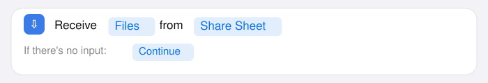
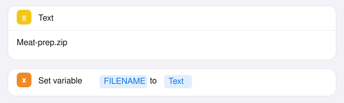
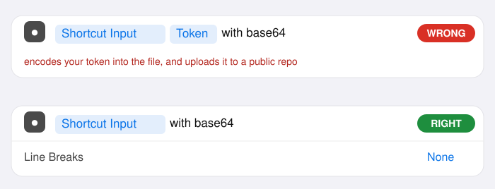
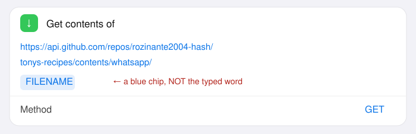
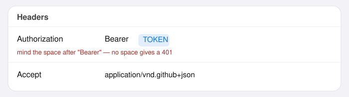
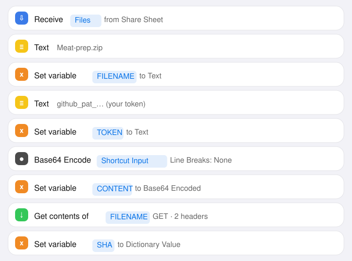
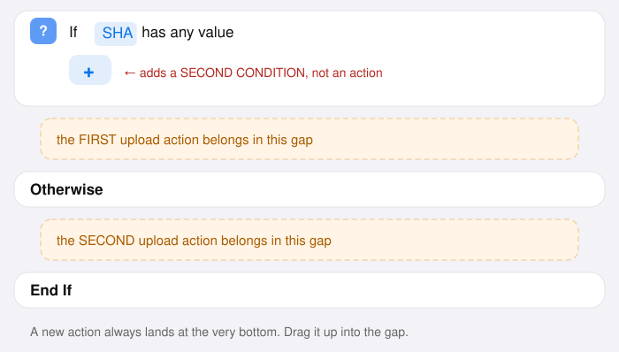
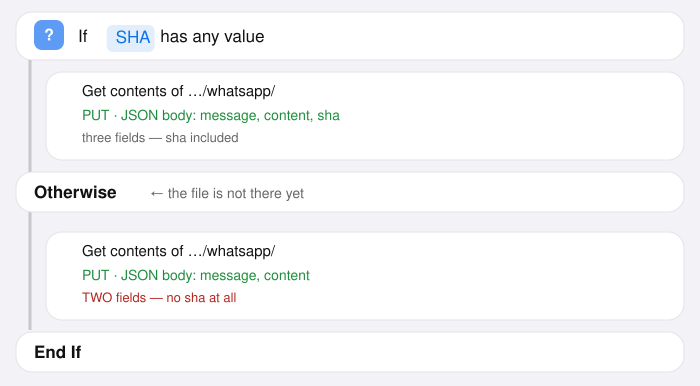

# Uploading a chat export straight from the iPhone

Goal: **WhatsApp → Export chat → Share → Shortcut → done.** No laptop in the middle.

The export step itself cannot be automated on any platform — WhatsApp has no API for it, and
anything driving WhatsApp Web breaches their terms and gets numbers banned. The *upload*
afterwards can be, and that is what this builds.

**As of v29.5 you only upload the file.** The app lists the folder over the GitHub API, so
`index.json` no longer has to be edited. It is still read, and still does one job: giving a file
a nicer group label than its file name.

> **Prefer to read this away from GitHub?**
> **[upload-guide.html](https://rozinante2004-hash.github.io/tonys-recipes/whatsapp/upload-guide.html)**
> is this same guide as one self-contained file — pictures embedded, works offline, prints tidily.
> Handy open on the iPad, or printed, while you build the Shortcut on the phone.
>
> **Three routes, easiest first.** Part 1 (the token) is needed by all three.
>
> 1. **Install the prebuilt Shortcut** — Part 2, short way. One file, one field to fill in.
>    Untested on a real phone, so treat it as the fast option rather than the sure one.
> 2. **[upload.html](https://rozinante2004-hash.github.io/tonys-recipes/whatsapp/upload.html)** —
>    no Shortcut at all. Tested end to end. A few more taps per export.
> 3. **Build the Shortcut by hand** — Part 2, long way. Longest, and the one known to work.

> **Don't fancy this?** There is a simpler route that needs no Shortcut at all:
> **[upload.html](https://rozinante2004-hash.github.io/tonys-recipes/whatsapp/upload.html)** —
> open it on the phone, add it to your Home Screen, paste the token once, pick the file, upload.
> A few more taps per export than the Share sheet, but nothing to build and nothing to go wrong.
>
> **The pictures below are mock-ups, not screenshots** — drawn to match what the Shortcuts editor
> shows so you can compare at a glance. Colours and spacing will differ slightly from your screen;
> the *words and the blue chips* are what to check against.
>
> **Written against the Shortcuts app as it looks in 2026**, and corrected against real
> screenshots. The **ⓘ is in the BOTTOM toolbar** — see 2.1. If your screen still doesn't match a
> step, say so rather than working around it; the layout moves between iOS versions and guessing
> at it has already cost two rounds here.

---

## Part 1 — Get a token first

Do this on the phone, in Safari, so you can paste the token straight into the Shortcut.

1. Go to <https://github.com/settings/personal-access-tokens/new>
2. **Token name:** `iPhone chat upload`
3. **Expiration:** pick a date you'll remember. When it lapses the Shortcut returns 401 —
   annoying, not dangerous.
4. **Repository access:** tap **Only select repositories** → choose
   `rozinante2004-hash/tonys-recipes`
5. **Permissions** → **Repository permissions** → find **Contents** → set it to
   **Read and write**. Leave everything else alone.
6. **Generate token**, then **copy it**. It is shown once and never again.

Paste it somewhere you can get at in a moment — Notes will do, and you can delete it after.

**Treat it like a password.** It goes into the shortcut in step 9, where it is visible to anyone
who opens the shortcut for editing — so it is also visible in any screenshot of that screen. If
one ever escapes, revoking and regenerating takes a minute:
<https://github.com/settings/personal-access-tokens>.

---

## Part 2 — the short way: install the prebuilt Shortcut

**All 33 steps of Part 2 are already done in a file in this folder.** Install it, paste your token
into one field, and you're finished. Part 3 onwards applies unchanged.

**[Send-chat-to-Recipes.shortcut](https://rozinante2004-hash.github.io/tonys-recipes/whatsapp/Send-chat-to-Recipes.shortcut)**

> ⚠️ **This file has never been run on a real iPhone.** It was generated from Apple's shortcut
> file format, which is undocumented and changes between iOS releases. It is very likely correct
> and it is quick to check — but if it refuses to import, or a row looks wrong, that is a fault in
> the file and worth reporting rather than working around. Building it by hand (below) is the
> route that is known to work.

### A. Allow it to install

A shortcut that did not come from an iCloud link is *untrusted*, and iOS blocks those by default.

**On iOS 26 the toggle is called "Private Sharing", not "Allow Untrusted Shortcuts".** The old name
is what every older article uses, and searching Settings for it finds nothing.

1. In **Settings**, pull down to reveal the search box and search **`Private Sharing`**. Searching
   is more reliable than a menu path — Settings has been reorganised more than once, and on iOS 26
   app settings live under **Settings → Apps → Shortcuts** rather than at the top level.
2. Turn it on.

> **Not there at all?** That is the normal state on a phone where the Shortcuts app has never run
> anything. **The toggle is hidden until you have run at least one shortcut.** Open Shortcuts, tap
> any shortcut in the Gallery to run it once — anything at all, it does not matter which — then go
> back to Settings and search again. This catches most people.

> **Still missing after running one?** Then it is almost certainly **Screen Time**, which removes
> this toggle entirely rather than greying it out. See *Screen Time blocks the upload* below — the
> same setting also blocks `api.github.com`, so it has to be dealt with for **every** route on this
> page, not just this one. Fix that first and the toggle comes back.

### B. Install it

3. Open the link above in **Safari on the phone**. It downloads.
4. Open **Files** → **Downloads** → tap **Send-chat-to-Recipes.shortcut**.
5. Shortcuts opens and shows the actions. Scroll to the bottom and tap **Add Shortcut**.

### C. The one field that is yours

The token is **not** in the file — a token committed to a public repository is a leaked token.

6. Open the shortcut for editing. The **third** action is a **Text** action reading
   `PASTE-YOUR-GITHUB-TOKEN-HERE`.
7. Tap it, select all, and paste the token from Part 1.

> ✅ **Should read:** `Set variable TOKEN to Text`, with the Text action above it holding your token
> (it starts `github_pat_`).

### D. Worth checking before the first real use

Two rows are worth a glance, because they are the two the generated file is least certain about:

| Row | Should read |
|---|---|
| The **first** Text action | `Meat_Whatsapp.txt` — the file name to write to. Change it if you want a different one. |
| The **If** row | `If SHA has any value`. If it reads something else, tap the condition and pick **has any value**. |

Then go to **2.8** to test it, and Part 3 to use it. If anything about the shortcut looks unlike
the pictures below, build it by hand instead — the rest of this document is that route, in full.

---

## Part 2 (the long way) — Build the Shortcut by hand

Open **Shortcuts** → **+** (top right) to create a new one. You should be on the screen from
your screenshot: the name at the top, "Add actions from below", and a search box.

### 2.1 Make it appear in the Share sheet

**The ⓘ button is in the BOTTOM toolbar**, not at the top. While editing a shortcut the bar along
the bottom reads `↶  ↷  ⓘ  ⬆  ▶` — undo, redo, **info**, share, run. Tap the **ⓘ** in the middle.

Two things that will otherwise waste your time:

- The **⌄ chevron beside the shortcut's name** is *not* it. That menu only has Rename, Choose
  Icon, Duplicate, Move and Add to Home Screen.
- **Searching the actions for "Receive" finds nothing**, because in this version it is not an
  action you can add. It is purely a setting, and the "Receive … from Share Sheet" row appears at
  the top of your shortcut *by itself* once the setting is on.

So:

1. Tap **ⓘ** in the bottom toolbar
2. Turn on **Show in Share Sheet**
3. Close the panel. A row now sits at the top of the shortcut reading something like
   *"Receive Text and images input from Share Sheet"*
4. Tap the blue **Text and images** in that row → **deselect everything**, select **Files** only




If your Shortcuts app does not match even this, skip the whole thing and use the upload page —
see the top of this document. It does the same job and needs no Shortcuts archaeology.

### 2.2 The file name

**5.** Search actions for `Text` → tap **Text**. **6.** Tap inside its box and type the name you
want the file to have in the repo, e.g. `Meat-prep.zip`

> ✅ **Should read:** a yellow **Text** action containing `Meat-prep.zip`

Keep it **plain ASCII** — letters, digits, dashes, and an extension. Hebrew belongs in the group
*label*, not the file name (Part 4).

**7.** Search for `Set Variable` → tap it. **8.** Tap **Variable Name**, type `FILENAME`

> ✅ **Should read:** `Set variable FILENAME to Text`
>
> The word **Text** at the end is a blue chip, not typed — Shortcuts fills it in because the Text
> action is directly above. If it says `Set variable FILENAME to Shortcut Input`, tap that chip
> and choose **Text** instead.




### 2.3 The token

**9.** Add another **Text** action → paste your token into it.
**10.** Add another **Set Variable** → name it `TOKEN`

> ✅ **Should read:** `Set variable TOKEN to Text`
>
> The capitalisation is only a label — `Token` works identically to `TOKEN`, as long as you insert
> *that same chip* later. Matching the guide exactly just makes the later steps easier to check.

> ⚠️ **The token is now visible whenever this shortcut is open for editing** — so it is visible in
> any screenshot of this screen. Do not send one to anyone, including me. If one escapes, revoke
> at <https://github.com/settings/personal-access-tokens> and paste a fresh one in. To show
> someone the shortcut, clear this Text action first, screenshot, then paste it back.

### 2.4 Turn the file into text

GitHub's API will not take a raw file. It takes **Base64** — a way of writing any file as plain
letters and digits. That is all this step does.

**11.** Search for `Base64` → tap **Base64 Encode**

> ✅ **Should read:** `Shortcut Input with base64` — **exactly one blue chip**, and it must say
> **Shortcut Input**.
>
> ⚠️ **Check for a second chip.** Shortcuts helpfully drops the *previous* action's output into
> this field, so it very often arrives reading `Shortcut Input  Token  with base64` — with a
> stray **Token** chip alongside. That is wrong twice over: it encodes your token together with
> the file, and then **uploads your token into the public repository** as part of the file's
> contents.
>
> To fix: tap the field, put the cursor after the stray chip, and press **⌫ backspace** until only
> **Shortcut Input** remains. Deleting the whole field and re-inserting **Shortcut Input** from the
> variable bar works too.
>
> The chip you want is the file WhatsApp handed you. Nothing else belongs here.




**12.** Tap the small **⌄** (or **Show More**) on that action and set **Line Breaks** to **None**

> ✅ **Should read:** the action expands to show `Line Breaks: None`
>
> **This is the single most common failure.** The default chops the text into lines, and GitHub
> answers **422** because a file's contents may not contain line breaks.

**13.** Add a **Set Variable** → name it `CONTENT`

> ✅ **Should read:** `Set variable CONTENT to Base64 Encoded`

---

### 2.5 Ask GitHub whether the file is already there

**First, why this step exists** — this is the part that is genuinely confusing, and it is worth
one paragraph before you tap anything.

GitHub treats *creating* a file and *replacing* a file as two different requests:

- **Creating** — you just send the contents.
- **Replacing** — you must also quote the **`sha`**, an ID GitHub gives the version currently
  stored. It is GitHub asking *"you did look at what's there before overwriting it, didn't you?"*

You do not know in advance which case you are in — the first time you send `Meat-prep.zip` it is a
create, every time after that it is a replace. **So you ask.** You request the file's details:

- **File exists** → GitHub returns its details, including a `sha`.
- **File does not exist** → GitHub returns **404 Not Found**, and there is no `sha`.

That difference — *did I get a `sha` or not?* — is what section 2.6 branches on. Nothing here
uploads anything; this step only asks a question.

A 404 here is **not an error**. It is the expected answer for a new file.

---

**14.** Search for `Get Contents of URL` → tap it

> ✅ **Should read:** `Get contents of` followed by an empty URL box

**15.** Tap the URL box and type this **exactly**, ending with the slash:

```
https://api.github.com/repos/rozinante2004-hash/tonys-recipes/contents/whatsapp/
```

**16.** With the cursor still at the end, look **just above the keyboard**. There is a bar of
suggestions — your variables live there. Tap **FILENAME**.

> ✅ **Should read:**
> `Get contents of https://api.github.com/repos/rozinante2004-hash/tonys-recipes/contents/whatsapp/FILENAME`
>
> **FILENAME must be a blue chip**, not black text. If it is black you typed the word instead of
> inserting the variable — the shortcut will then ask GitHub for a file literally called
> "FILENAME", get a 404, and you will spend an hour suspecting your token. Tap the word, delete
> it, and pick it from the bar above the keyboard instead.
>
> If you cannot see the variable bar, tap the URL box once more — it appears only while that field
> has the cursor.




**17.** Tap **Show More** on this action to reveal Method, Headers and Request Body.

**18.** Set **Method** to **GET**

> ✅ **Should read:** `Method: GET`
>
> (It is usually GET already.)

**19.** Under **Headers**, tap **Add new field**. Key: `Authorization`. For the value, type
`Bearer ` — **including the space after "Bearer"** — then insert the **TOKEN** variable from the
bar above the keyboard.

> ✅ **Should read:** `Authorization` → `Bearer TOKEN`
>
> with **TOKEN** as a blue chip. The space matters: `BearerTOKEN` is rejected as a **401**, which
> looks exactly like a bad token and sends you off regenerating one that was fine.

**20.** **Add new field** again. Key: `Accept`. Value: `application/vnd.github+json`

> ✅ **Should read:** `Accept` → `application/vnd.github+json`
>
> This one is plain text — no variable.




**21.** Leave **Request Body** alone. A GET sends nothing.

**22.** Search for `Get Dictionary Value` → tap it. Set **Key** to `sha`.

> ✅ **Should read:** `Get sha from Contents of URL`
>
> The **Contents of URL** chip is the answer from step 14. If it says something else, tap it and
> choose **Contents of URL**.

**23.** Add a **Set Variable** → name it `SHA`

> ✅ **Should read:** `Set variable SHA to Dictionary Value`

**At this point the shortcut, top to bottom, should look like this:**



In text, if you prefer to compare that way:

```
Receive Files from Share Sheet
Text                         → Meat-prep.zip
Set variable FILENAME to Text
Text                         → github_pat_…
Set variable TOKEN to Text
Base64 Encode Shortcut Input   (Line Breaks: None)
Set variable CONTENT to Base64 Encoded
Get contents of https://api.github.com/…/whatsapp/FILENAME
Set variable SHA to Dictionary Value
```

Nine actions. If yours matches, 2.6 is the last part.

---

### 2.6 Upload it

#### What this section is doing, before you tap anything

Everything so far has been preparation. This is the part that actually sends the file.

GitHub uploads a file with a **PUT** to the same address you just read from. It wants the request
phrased slightly differently depending on whether the file is already there:

| Situation | What GitHub wants | What it does if you get it wrong |
|---|---|---|
| File **already there** (a sha came back) | the content **and** that `sha` | without the sha: `409 Conflict` |
| File **not there yet** (no sha) | the content, and **no `sha` field at all** | with an empty sha: `422 Unprocessable` |

A single action cannot say *"include this field only sometimes"*. So you build the upload action
**twice** — once in each half of the If — and the two copies are **identical except that one has a
third body field and the other doesn't**.

> **You are meant to build the same thing twice. That is not a mistake in the guide.**
> If it feels redundant while you're doing it, you're doing it right. It is eight taps of
> duplication to avoid an error that would otherwise bite you the first time you re-export a chat.

Step 2.5 was the question — *"is it already there?"*. Step 2.6 is the two possible answers.

#### Where you are now

You have this — the block exists but both halves are empty:



> ⚠️ **Do not tap the `+` inside the If card.** It looks like "add an action here", but it adds a
> **second condition** to the If (as in *"if SHA has any value **and** …"*). You want it to keep
> exactly one condition. If you tapped it and got an extra row, tap the ⊗ on that row to remove it.

**How to get an action into a gap.** Tapping an action in the search panel puts it at the **very
bottom of the shortcut**, below `End If` — every time, no matter what you had selected. That is
normal. You then **press and hold the action and drag it up** into the gap. While you drag, the
other cards part to show where it will land. This drag is the only fiddly moment in the whole
build; everything after it is filling in fields.

#### The first upload — the "file is already there" half

**26.** Search for `Get Contents of URL` → tap it. It appears at the bottom, under `End If`.
Press and hold it and **drag it into the gap between `If` and `Otherwise`.**

> ✅ **Should read**, once dragged — the new action visibly **indented** under `If`:
>
> ```
> If  SHA  has any value
>     Get contents of              ← indented: it is inside the If
> Otherwise
> End If
> ```
>
> If it is *not* indented, it is sitting after the block instead of inside it. Drag again.
> Indentation is the only way to tell, so check it now rather than at the end.

**27.** Tap the URL field. Type the address, then insert **FILENAME** from the variable bar —
exactly as in step 15. It is the same URL as the GET.

> ✅ **Should read:** `https://api.github.com/repos/rozinante2004-hash/tonys-recipes/contents/whatsapp/` followed by a blue **FILENAME** chip
>
> The chip must be blue. The typed word `FILENAME` in black is the single most common slip here.

**28.** Tap **Show More** → **Method** → change `GET` to **PUT**.

> ✅ **Should read:** `Method   PUT`

**29.** **Headers** → add the same two as steps 19–20:

| Header | Value |
|---|---|
| `Authorization` | `Bearer ` then the blue **TOKEN** chip — *mind the space after "Bearer"* |
| `Accept` | `application/vnd.github+json` |

> ✅ **Should read:** two header rows, and the Authorization value showing `Bearer` followed by a
> blue chip — not a long string of characters. If you can *read* your token on screen, you have
> typed it in rather than inserted the variable. That works, but it puts the token in a second
> place; prefer the chip.

**30.** **Request Body** → **JSON**. Then **Add new field** → **Text**, three times:

| # | Key | Value |
|---|---|---|
| 1 | `message` | `Update chat export` — plain typed text; it becomes the commit message |
| 2 | `content` | the blue **CONTENT** chip |
| 3 | `sha` | the blue **SHA** chip |

> ✅ **Should read**, the whole action:
>
> ```
> Get contents of  https://api.github.com/.../whatsapp/[FILENAME]
>   Method         PUT
>   Headers        Authorization: Bearer [TOKEN]
>                  Accept: application/vnd.github+json
>   Request Body   JSON
>     message      Update chat export
>     content      [CONTENT]
>     sha          [SHA]
> ```
>
> Three body fields. Two of the three values are blue chips. Keys are lower-case — GitHub is
> case-sensitive here, so `SHA` as a *key* will not work even though the *variable* is called SHA.

#### The second upload — the "brand new file" half

> **You can skip this step for now and still have a working shortcut.** This half only runs the
> *first* time a given file name is uploaded. `Meat_Whatsapp.txt` already exists in the repo, so
> for re-exporting that chat — the everyday case — the **If** half is the one that runs and this
> one never does. Get it working first, and come back to this before you add a *new* group.
>
> The catch if you leave it empty: uploading a file name that isn't in the repo yet will do
> nothing at all, while still showing "Uploaded to Recipes". Until this half exists, create a new
> file on github.com first, then let the shortcut replace it.

**31.** Build a second **Get Contents of URL** in the gap **between `Otherwise` and `End If`**,
set up exactly like the first — *but with only two body fields: `message` and `content`.* **No
`sha`.**

Repeat steps 26–30, stopping short of the third body field. Six fields in total: URL, Method,
two headers, and two body rows.

> **If your iOS offers Duplicate, use it** — press and hold the finished action and look for it in
> the menu, then drag the copy down and delete its `sha` row. On current iOS a press-and-hold may
> simply pick the card up to drag it rather than opening any menu, in which case there is nothing
> to find and nothing you are doing wrong. Building it again is six fields; it is not worth
> fighting the gesture.

> ✅ **Should read**, the second copy:
>
> ```
> Get contents of  https://api.github.com/.../whatsapp/[FILENAME]
>   Method         PUT
>   Headers        Authorization: Bearer [TOKEN]
>                  Accept: application/vnd.github+json
>   Request Body   JSON
>     message      Update chat export
>     content      [CONTENT]
> ```
>
> **TWO** body fields, not three. No `sha` row at all — not an empty one, not a blank one.
> Deleting the row is the point; leaving it there with nothing in it is the error this whole
> section exists to avoid.

#### The finished block



> ✅ **Should read**, the shape of the whole thing — note which lines are indented:
>
> ```
> If  SHA  has any value
>     Get contents of …/FILENAME   PUT · body: message, content, sha
> Otherwise
>     Get contents of …/FILENAME   PUT · body: message, content
> End If
> ```
>
> Four things to confirm: **one** action inside each half; both **indented**; both **PUT**; and the
> upper one has **three** body fields while the lower one has **two**.

### 2.7 Tell yourself it worked

**32.** After **End If**, add **Show Notification** with text `Uploaded to Recipes`

> ✅ **Should read:** `Show notification Uploaded to Recipes`

Worth having: without it, a silent failure looks exactly like success.

**33.** Tap the shortcut's name at the top → **Rename** → `Send chat to Recipes`

### 2.8 Test it before you need it

Tap **▶** (bottom right). With no file shared in, it should fail at the Base64 step — that is
fine and expected. The real test is Part 3.

Better first test: share **any small file** to it from the Files app. If you get *"Uploaded to
Recipes"*, check it landed:

<https://api.github.com/repos/rozinante2004-hash/tonys-recipes/contents/whatsapp>

Then delete the test file from GitHub in a browser.

---

## Part 3 — Use it

1. WhatsApp → open the group → tap the group name at the top
2. Scroll down → **Export Chat** → **Without Media**
3. In the Share sheet, pick **Send chat to Recipes**
4. In the app: ⚙️ Settings → 💬 WhatsApp Groups → **Load chats from this folder**

WhatsApp gives you a `.zip` containing `_chat.txt`. **Upload it exactly as it is** — the app
sniffs the zip header and unpacks it itself. The file extension does not matter.

Re-exporting a chat gives you the **entire** history again, not just the new part — so upload it
under the **same file name** to replace the old one. That is what the `sha` branch is for.

---

## Part 4 — Giving a group a proper name

By default the group label comes from the file name. For something better — Hebrew, say — add it
to `index.json` once:

```json
[
  { "file": "family-food.zip", "group": "אוכל משפחתי" }
]
```

The file is picked up without this. `index.json` only supplies the label now.

---

## Screen Time blocks the upload

> **"The action could not run because "api.github.com" was blocked by the Content Restrictions on
> this device."**

This is not a fault in the shortcut — the OS refused the request before it left the phone. It hits
**every** route on this page, including `upload.html`, because they all talk to the same API.

**Settings → Screen Time → Content & Privacy Restrictions → Content Restrictions → Web Content**,
then either:

- set it to **Unrestricted Access**, or
- leave it on **Limit Adult Websites** and add `https://api.github.com` under
  **ALWAYS ALLOW** → **Add Website** — the narrower fix, and the one to prefer if the restriction
  is there deliberately.

You will need the Screen Time passcode. If the path does not match your phone, search Settings for
`Content Restrictions` rather than hunting through menus.

**The same setting is why "Private Sharing" is missing** from Settings → Shortcuts. Screen Time
removes that toggle rather than greying it out, so fixing this brings it back and makes the
prebuilt Shortcut installable.

---

## When it doesn't work

| What you see | What it means |
|---|---|
| **"blocked by the Content Restrictions on this device"** | Screen Time — see the section directly above. Nothing to do with the shortcut. |
| Shortcut isn't in the Share sheet | The **Receive … from Share Sheet** action isn't first, or its "what" isn't set to **Files**. Also check WhatsApp's sheet — scroll right and tap **More**. |
| **401** | Token expired or mistyped. Check the `Authorization` value is `Bearer ` **with a space** then the variable. |
| **404** on the upload | Token can't reach this repo — recheck *Only select repositories* and *Contents: Read and write*. |
| **422** | Almost always Base64 line breaks (step 13). Otherwise: the **Otherwise** branch still has a `sha` field. It must be deleted, not blank — step 31. |
| **409** | The **If** branch is missing its `sha` field, or has it as a typed word rather than the blue chip — step 30. (Rarely: two uploads genuinely raced; run it again.) |
| Uploads, but always creates a second file rather than replacing | Both halves are outside the If block, so only one ever runs. Check the indentation in the finished-block picture at the end of 2.6. |
| Uploads fine, app shows nothing | Tap *Load chats from this folder* again. If still nothing, the file may not be a real export — the app needs the `[date, time] Name: message` shape and will say so. |

To see what actually landed — no token needed, works in Safari:

<https://api.github.com/repos/rozinante2004-hash/tonys-recipes/contents/whatsapp>

That's the same listing the app itself reads.

---

## Two things worth deciding first

**The token lives on your phone.** Scoped to one repo with only Contents write, the worst someone
with your unlocked phone could do is edit this repository. That is why it is a fine-grained token
rather than a classic one.

**This repository is public, so the chats are public.** That is equally true of the laptop route —
this changes nothing — but it is worth a conscious decision before uploading a family group. If
you'd rather they weren't, ⚙️ Settings → 💬 WhatsApp Groups → *Import exported .txt files* keeps
them in the browser and uploads nothing.
